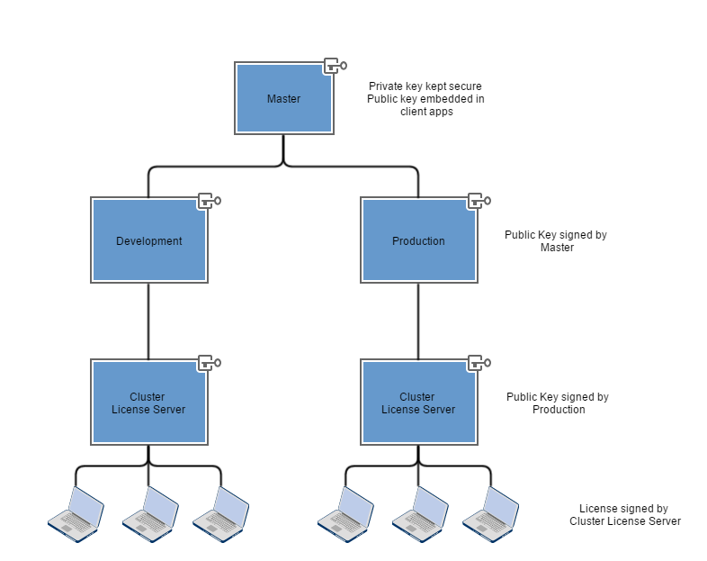

# Lithium
Lithium is a licensing protocol which provides the ability to provide time locked, floating
and leased licensing both over the internet and through an intranet server.

The primary design considerations with Lithium are that it should support licensing of a
wide range of applications with varying requirements, it should enable clients to verify the
integrity of a license without needing to communicate with a license server and should cater
to both node-locked and floating license use cases.

Beyond that, it should be hardened against passive side-channel attacks, should be easily
implemented on different platforms and should offer a reasonable degree of safety for general
use cases. Active attacks such as binary manipulation are not covered under the scope of Lithium
and should make use of an alternative strategy to protect distributed binaries against
manipulation.

## Architecture

### License Data
Licenses are constructed out of a structured JSON object containing license metadata as well
as a customizable payload segment. The payload segment is intended to be customized by the
license consumer for toggling the availability of functionality and configuring options in
the software.

```json
{
    "meta": {
        "id": "8ddcb55cd6a341b48c4aa7b611e1721b",
        
        "activates": "2016-02-14T06:08:12.012Z",
        "expires": "2016-02-14T08:10:12.014Z"
    },
    
    "payload": {
        "feature1": true
    }
}
```

### License Validation
Licenses are signed using asymmetric cryptographic signatures. These signatures are generated
using the private key of the server generating the license, allowing the validity to be confirmed
by checking the license's signature against the public key of that server. This ensures that
the license originated from the specified server, while the server's published certificate
chain enables clients to verify that the server's license originated from a trusted license
source.

The server's certificate (public key) may be signed for a limited period of time, in which
case licenses it generates will only remain valid for, at most, its validity period. Servers
may also opt to only sign licenses for a portion of the server's validity period - enabling
use cases like floating licenses or time-limited offline usage.



### License Protection
License files are also encrypted to prevent them from being readable by anybody but the
target machine. This is achieved by encrypting the license pack using the machine's public
key, which is sent with the license request.

Locally, the machine's private key may be encrypted using machine specific data like processor
codes, MAC addresses etc. Decisions about how the private key is protected fall outside the
purview of this specification and will depend on the platform you are targetting.

## License Packing
Licenses are packed in the following format prior to encryption. This enables simple parsing
using any JSON library once decryption is complete, as well as making it straightforward for
a human to analyze the license for obvious defects or errors.

```json
{
    "chain": [
        "{{master_cert}}",
        "{{parent_cert}}",
        "{{license_server_cert}}"
    ],
    "license": {
        "meta": {
            "id": "8ddcb55cd6a341b48c4aa7b611e1721b",
            
            "activates": "2016-02-14T06:08:12.012Z",
            "expires": "2016-02-14T08:10:12.014Z"
        },
        
        "payload": {
            "feature1": true
        }
    },
    "signature": {
        "type": "DSA",
        "data": "{{license_signature}}"
    }
}
```

### Chain
The chain is a `string[]` of signed certificates representing the signature chain of servers
which has resulted in this license being generated. Each certificate in the chain is expected
to be signed by the previous certificate's corresponding private key.

The first certificate is expected to match the public key embedded within the application at
compile time.

Similarly, the final certificate is expected to be the certificate used to generate the
`signature` for the license.

If any of these conditions is not met, the license is determined to be invalid and the
application should inform the user to this effect.

### Signature
The signature field represents the asymmetric cryptographic signature of the JSON encoded
license data from the `license` field, signed by the private key of the final certificate
in the certification chain.

If the signature does not match the expected signature for the data, given the public key
available in the signature chain, then the certificate is considered tampered with and
invalid. The application should inform the user to this effect.

### License
The license field contains the structured license object. Once the license has been confirmed
to originate from a trusted source, the application is responsible for confirming that the
current time rests between the `activates` and `expires` times. If it does not, the license
is considered to have expired and the user should be informed.

## Implementation Details

### Clock Skew
Due to the nature of distributed systems, it is likely that the local machine's clock will
have an offset from the license server's clock. When making a license request, the server
should accept a reasonable clock skew parameter (a couple of minutes at most) and generate
a license which caters for the target machine's clock time.

Alternative, though illadvised, approaches include storing a clock offset on the local machine
as well as updating the local machine's time to match the license server's time. The former
opens an attack surface, namely that the file may be modified to inject any desired offset
and thereby extend a license indefinitely; the latter may not be possible across different
platforms or may pose problems for certain classes of user or software.

### Floating Licenses
Floating licenses, specifically those which work on a "seats" basis, are intended to be
implemented through the use of continually renewed, short-lived licenses. These would be
set to expire after between 60 seconds and 5 minutes, depending on the application. The
application would request a license renewal once its local time approached a certain threshold
from the current license's expiry time, for example - 30 seconds from expiry.

On the server side, licenses will only be generated when there are available license tokens
in the pool or when a renewal request is received for a valid license. In the case of a renewal
request, the expiry time for the relevant license (identified by its `id` is updated and sent
to the requesting client). It is important to note that renewed licenses should only be generated
for the client who previously checked out the license so as to prevent multiple nodes using the
same license. 

Licenses are returned to the pool when they expire, ensuring that offline users do not hold
licenses which they are unable to use.